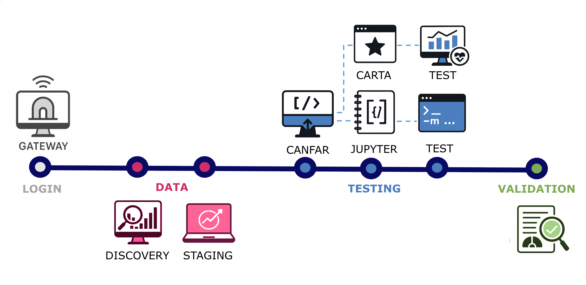

The test is considered a success only if all of these steps are successful:

1. Log in to the Gateway
2. Discover the data
3. Stage the data to the relevant node
4. Access CANFAR through the Gateway
5. Create a new CANFAR session
    - Using CARTA
    - Using Jupyter notebooks
6. Run the notebook tests
7. Run the CARTA tests
8. Validate the results and fill in the report

### CANFAR
1. Log in to the [gateway](https://gateway.srcdev.skao.int) 
    * using `xzu`
2. Data Discovery 
    * RA 150 SEC 1 degrees 10
    * found `pi24_run_1_cleaned_reupload.fits`
    * check [screenshot](data-discover.png)
3. Set up User workspace
    - open [CANFAR](https://canfar.ska.zverse.space/science-portal/) through the gateway
    - init carta instance, check [screenshot](init_carta.png)
    - staging data, check [screenshot](staging.png)
4. Validate -> OOM

### Jupyter Notebook
1. Log in to the [gateway](https://gateway.srcdev.skao.int) 
    * using `xzu`
2. Data Discovery 
    * RA 150 SEC 1 degrees 10
    * found `pi24_run_1_cleaned_reupload.fits`
    * check [screenshot](data-discover.png)
3. Set up User workspace
    - staging data, check [screenshot](staging.png)
    - init notebook, check [screenshot](init_notebook.png)